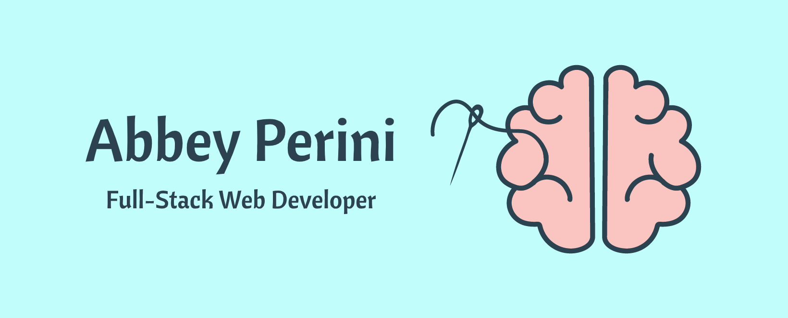
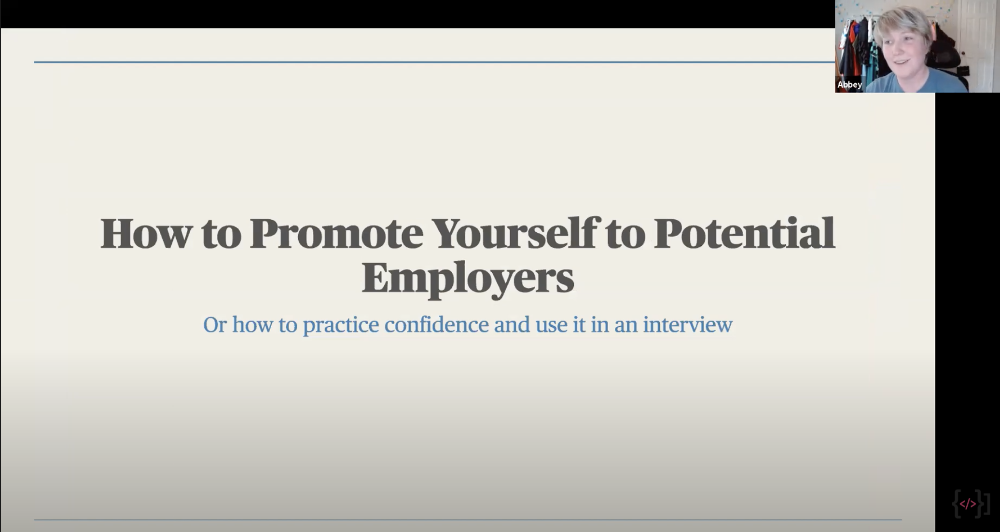
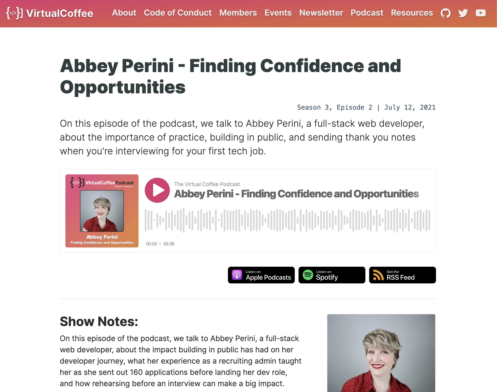
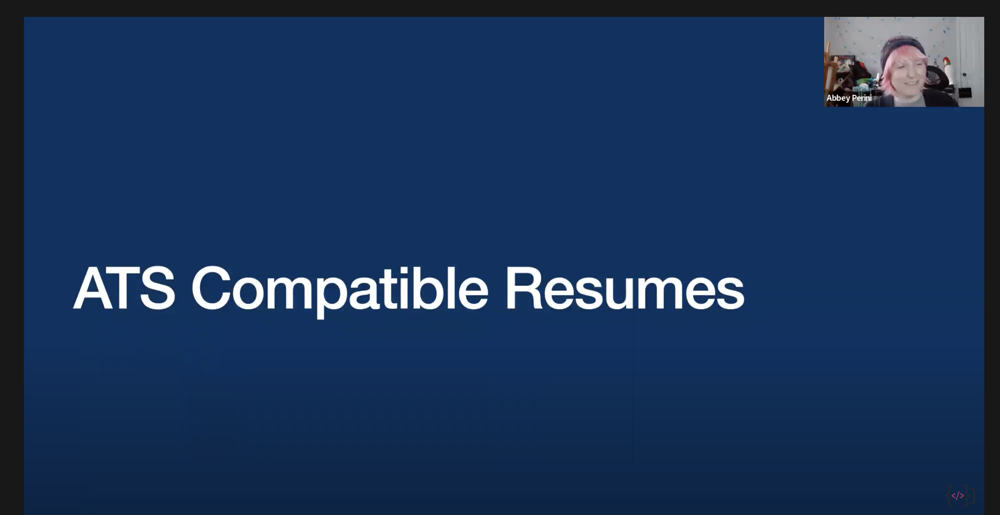
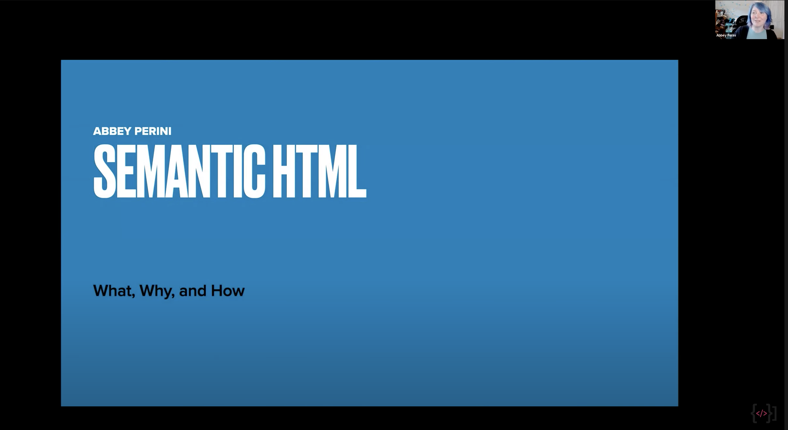
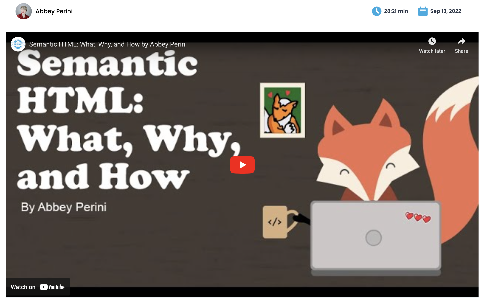

# Welcome! 
Here you will find all the open source code I've written like my [portfolio](https://github.com/abbeyperini/Portfolio2.0), [personal website](https://github.com/abbeyperini/abbeyperini.github.io), [tutorials](https://github.com/abbeyperini/ReactReload), and [hobby projects](https://github.com/abbeyperini/Knitworthy). Learn more about me and how to contact me by visiting https://abbeyperini.dev

## Current focus
* In my current role, I'm working in React, Typescript, Next.js, and dipping my toe in mobile development!
* Volunteering in Virtual Coffee.
* Blogging

## Talks and Interviews

| Promoting Yourself to Potential Employers | Finding Confidence and Opportunities |
| :--: | :--: |
|  |  
| Optimize Your Resume For Both A Hiring Manager And An ATS | Lightning Talk - Semantic HTML: What, Why, and How |
|  |  |
| Front-end Foxes Day - Semantic HTML: What, Why, and How | |
| | |

## My latest blog posts 
<!-- MEDIUM-STORY-LIST:START -->
- [From Idea to Design for Non-Designers](https://dev.to/abbeyperini/from-idea-to-design-for-non-designers-m6d)
- [Dark Mode Toggle and prefers-color-scheme](https://dev.to/abbeyperini/dark-mode-toggle-and-prefers-color-scheme-4f3m)
- [8 Ways to Support Women Developers](https://dev.to/abbeyperini/8-ways-to-support-women-developers-55lf)
- [From Research to Writing Reference Material](https://dev.to/abbeyperini/from-research-to-writing-reference-material-2ao9)
- [TL;DR CommonJS vs ESM](https://dev.to/abbeyperini/tldr-commonjs-vs-esm-47dk)
<!-- MEDIUM-STORY-LIST:END -->

## Where you can find me
* [Dev.to](https://dev.to/abbeyperini)
* [Hashnode](https://abbeyperini.hashnode.dev/)
* [Twitter](https://twitter.com/AbbeyPerini)
* <a rel="me" href="https://hachyderm.io/@AbbeyPerini">Mastodon</a>
* [LinkedIn](https://www.linkedin.com/in/abigail-perini/)
* [Virtual Coffee](https://virtualcoffee.io/) - a global community for supporting developers of any level
