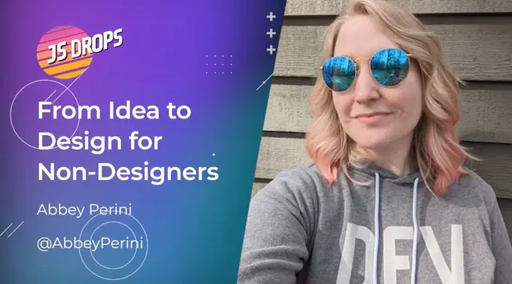
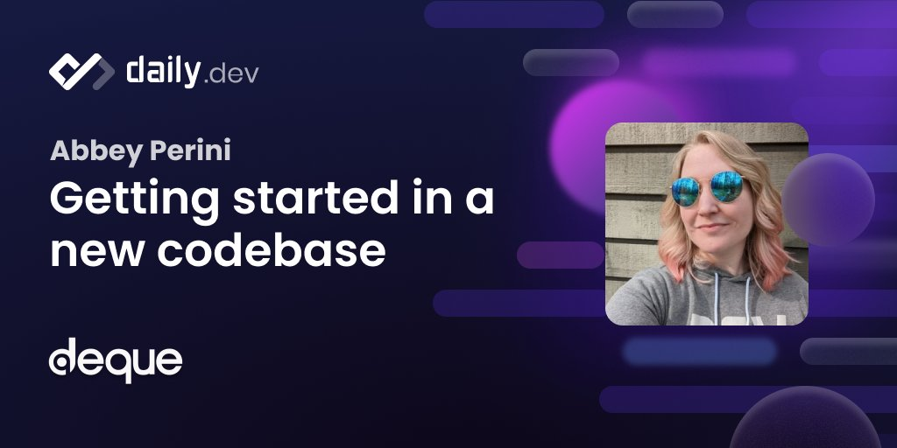

# Welcome! 
Here you will find all the open source code I've written. Learn more about me and how to contact me by visiting https://abbeyperini.dev

## My latest blog posts 
<!-- MEDIUM-STORY-LIST:START -->
- [A Love Letter to the Underrepresented in Tech](https://dev.to/abbeyperini/a-love-letter-to-the-underrepresented-in-tech-4jj3)
- [Slots, Slots, Slots, Everybody!](https://dev.to/abbeyperini/slots-slots-slots-everybody-4p5i)
- [Three Human Problems in a Technical Trench Coat](https://dev.to/abbeyperini/three-human-problems-in-a-technical-trench-coat-90k)
- [🌟 #DEVImpact2023 Reflections](https://dev.to/abbeyperini/devimpact2023-reflections-3p32)
- [12 Tips for Attending a Tech Conference](https://dev.to/abbeyperini/12-tips-for-attending-a-tech-conference-14mp)
<!-- MEDIUM-STORY-LIST:END -->

## Talks and Interviews

| Promoting Yourself to Potential Employers | Finding Confidence and Opportunities |
| :--: | :--: |
|  |  
| Optimize Your Resume For Both A Hiring Manager And An ATS | Lightning Talk - Semantic HTML: What, Why, and How |
|  |  |
| Front-end Foxes Day - Semantic HTML: What, Why, and How | From Idea to Design for Non-Designers on JSDrops |
|  | | 
| Getting Started in a New Codebase on The Monthly Dev |
|  |

## Where you can find me
* [Dev.to](https://dev.to/abbeyperini)
* [Hashnode](https://abbeyperini.hashnode.dev/)
* [Twitter](https://twitter.com/AbbeyPerini)
* [LinkedIn](https://www.linkedin.com/in/abigail-perini/)
