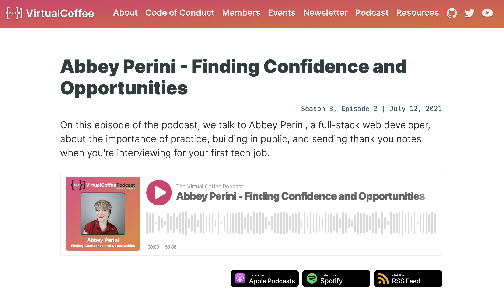

# Welcome! 
Here you will find all the open source code I've written like my [portfolio](https://github.com/abbeyperini/Portfolio2.0), [personal website](https://github.com/abbeyperini/abbeyperini.github.io), [tutorials](https://github.com/abbeyperini/ReactReload), and [hobby projects](https://github.com/abbeyperini/Knitworthy). Learn more about me and how to contact me by visiting https://abbeyperini.dev

# Current focus:
* In my current role, I'm working in React, Typescript, Next.js, and dipping my toe in mobile development!
* Volunteering in Virtual Coffee.
* Blogging once a month about things I love about coding.

# Talks and Interviews

| Promoting Yourself to Potential Employers | Finding Confidence and Opportunities |
| :--: | :--: |
|  |  
| Semantic HTML: What, Why, and How |
| :--: |
|  | 

# My latest blog posts 
<!-- MEDIUM-STORY-LIST:START -->
- [Coding and ADHD - Can&#39;t Stop](https://dev.to/abbeyperini/coding-and-adhd-cant-stop-10mf)
- [Coding and ADHD - Can&#39;t Keep Going](https://dev.to/abbeyperini/coding-and-adhd-cant-keep-going-5aj2)
- [Coding and ADHD - Can&#39;t Start](https://dev.to/abbeyperini/coding-and-adhd-cant-start-23l3)
- [Coding and ADHD - ADHD Brains](https://dev.to/abbeyperini/coding-and-adhd-adhd-brains-im1)
- [Web Development === Accessibility](https://dev.to/abbeyperini/web-development-accessibility-f8i)
<!-- MEDIUM-STORY-LIST:END -->

# Where you can find me:
* [Dev.to](https://dev.to/abbeyperini)
* [Medium](https://medium.com/@abbeyperini)
* [Hashnode](https://abbeyperini.hashnode.dev/)
* [Twitter](https://twitter.com/AbbeyPerini)
* [LinkedIn](https://www.linkedin.com/in/abigail-perini/)
* [Virtual Coffee](https://virtualcoffee.io/) - a global community for supporting developers of any level
